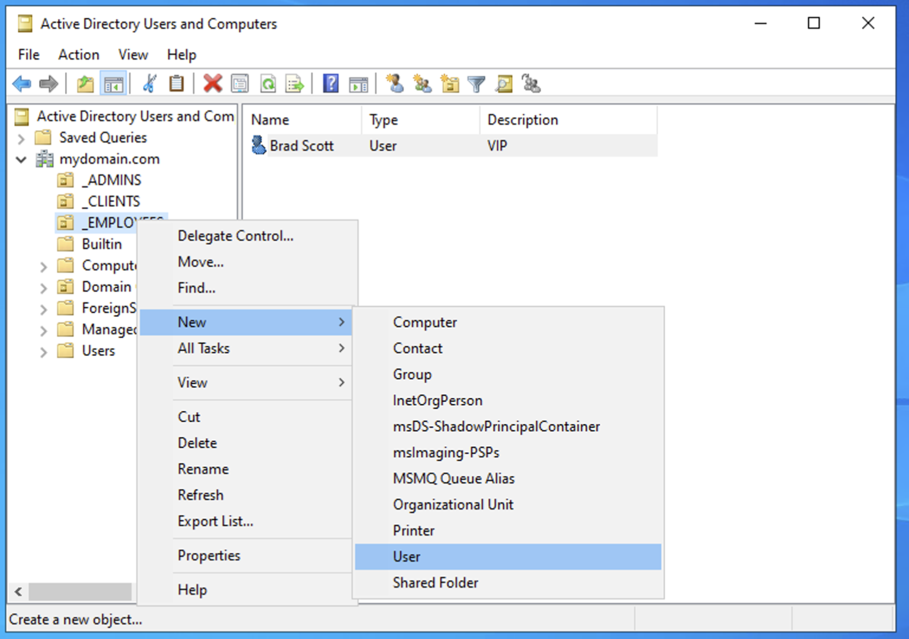
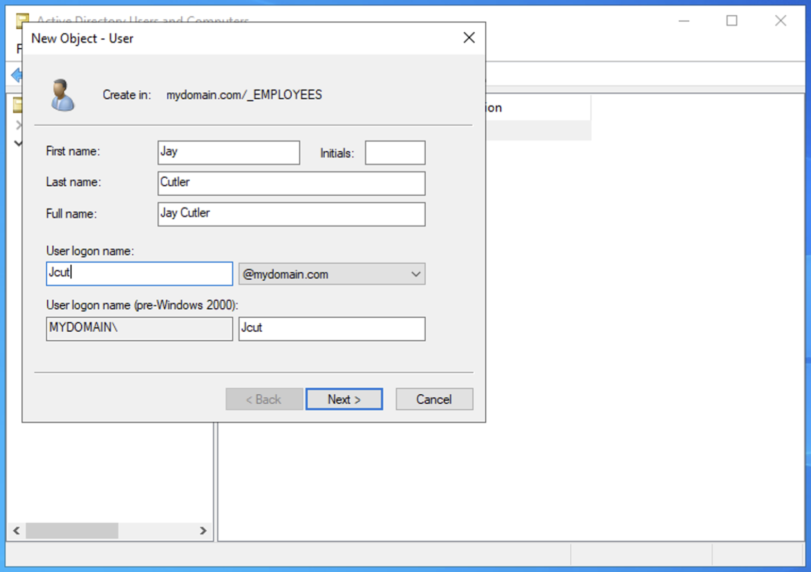
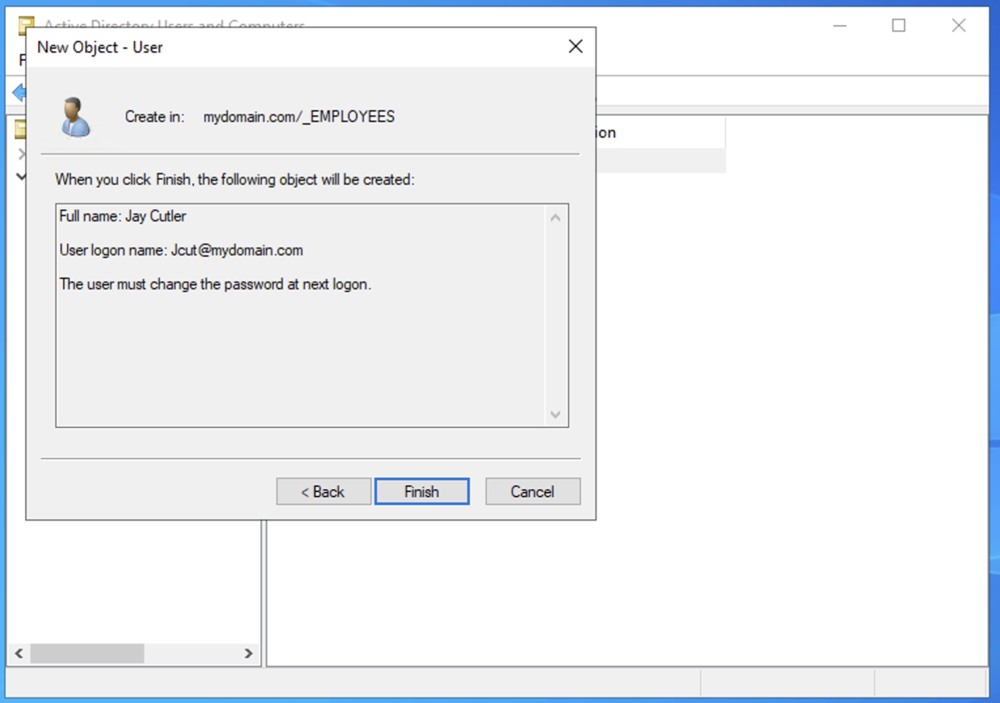
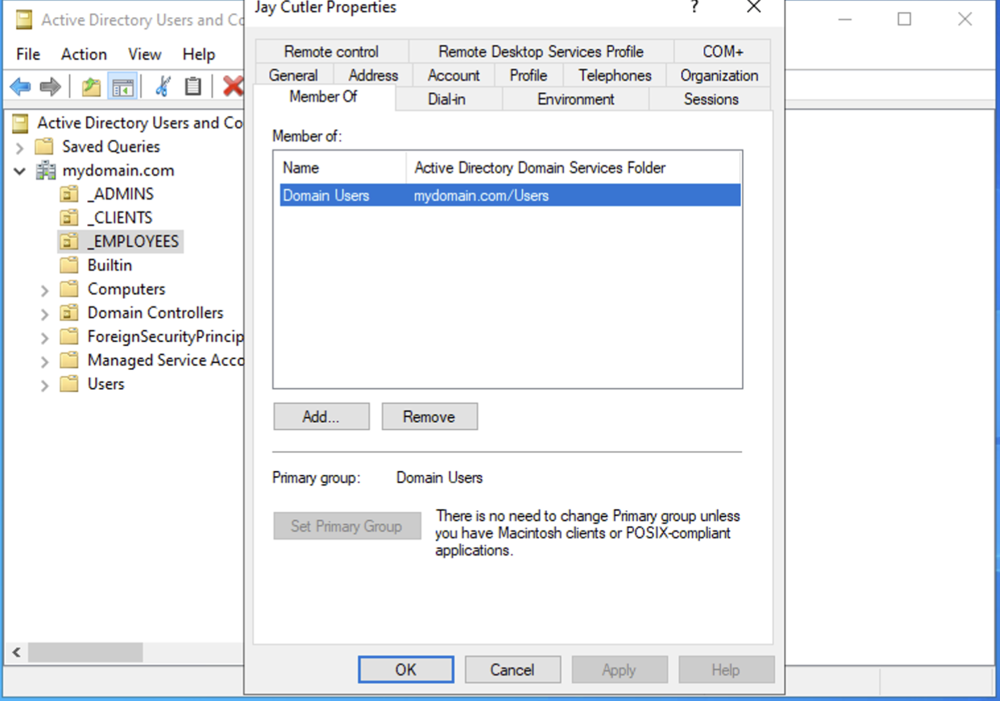

# Active Directory User Management Lab

## 📌 Project Overview

This project demonstrates **hands-on Active Directory (AD) labs** focused on **user and account management**.  

The goal is to practice foundational Active Directory skills, including creating new user accounts, setting initial passwords, and verifying group memberships. This lab is ideal for **entry-level IT and system administration roles**.

---

## 🛠 Technologies & Tools Used

- Windows Server with Active Directory Domain Services (AD DS)
- Active Directory Users and Computers (ADUC)
- User account management features

---

## 🌍 Environment

- Windows Server Domain Controller
- Active Directory Domain

---

## 🎯 Skills Demonstrated

- Creating new user accounts in Active Directory
- Configuring user credentials and password policies
- Verifying group memberships
- Navigating Organizational Units (OUs)  
- Basic Active Directory administrative tasks

---

# 🚀 Lab Steps

---

## 1️⃣ Initiating User Creation

Open **Active Directory Users and Computers (ADUC)**, navigate to the appropriate **Organizational Unit (OU)**, and open the context menu to create a new user.

📸 Screenshot:  

---

## 2️⃣ Entering User Identity Information

In the **New Object – User** window, enter the user's **First Name, Last Name, and User Logon Name (username)**.

📸 Screenshot:  

---

## 3️⃣ Setting the Initial Password

Configure the user's initial password and select **“User must change password at next logon”** to enforce password security.

📸 Screenshot:  

---

## 4️⃣ Confirming User Creation

Review the user account details on the **confirmation screen** before finalizing the creation process.

📸 Screenshot:  

---

## 5️⃣ Verifying User Group Membership

Open the newly created user's **Properties** window to confirm **successful creation** and verify default membership in the **Domain Users** group.

📸 Screenshot:  

---

# 📊 Lab Outcome

- A new user account was successfully created in Active Directory.  
- Initial credentials and password policies were configured.  
- Default group membership was verified (Domain Users).  
- Basic AD administrative skills were practiced and demonstrated.

---

# 📚 Key Takeaways

- Understanding Organizational Units and their role in AD structure  
- Importance of password policies and user security  
- Verifying user accounts and group memberships  
- Practical hands-on experience for entry-level system administration

---

# 📌 Future Improvements

- Add additional users in bulk using PowerShell scripts  
- Assign custom group memberships  
- Explore account lockout policies and user permissions  
- Implement Active Directory auditing for security

---

# 🏁 Conclusion

This lab demonstrates **foundational Active Directory skills** in user creation and account management.  

It provides practical exposure to **user management, password configuration, and group membership verification**, which are essential competencies for entry-level IT and system administration roles.

---

## 👤 Author

**Gokah William**  
IT & System Administration Professional  
Focused on Active Directory, User Management, and Entry-Level IT Skills
